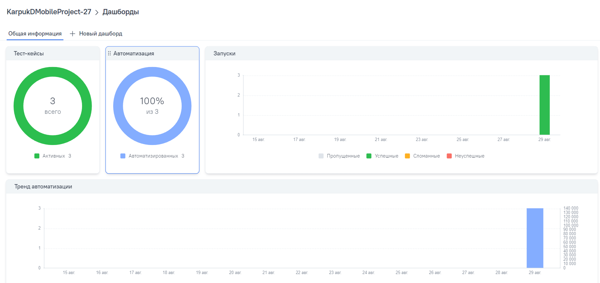
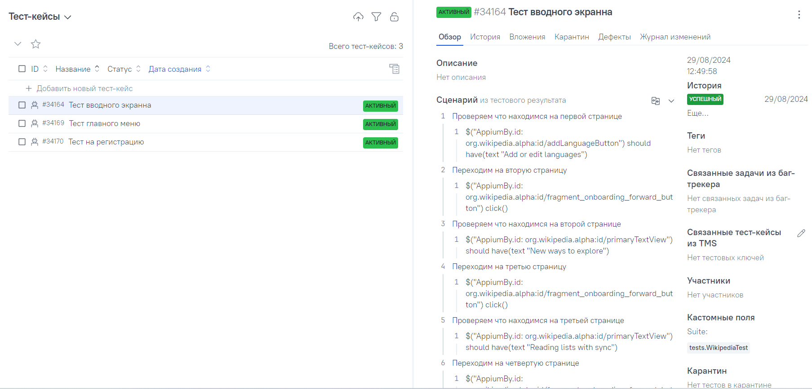
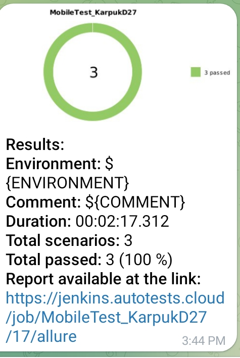

# Проект по автоматизации mobile тестов для приложения [Wikipedia](https://ru.wikipedia.org/)
<p align="center"><a href="https://ru.wikipedia.org/"></a></p>  

> Википедия - общедоступная многоязычная универсальная интернет-энциклопедия со свободным контентом, реализованная на принципах вики.

# 🧾 Содержание:

- <a href="#tools">Технологии и инструменты</a>
- <a href="#checking">Тестовые сценарии, реализованные в автоматизированных тест-кейсах</a>
- <a href="#jenkins">Сборка в Jenkins</a>
- <a href="#console">Запуск тестов (Из терминала)</a>
- <a href="#allureReport">Allure-отчет</a>
- <a href="#allure">Интеграция с Allure TestOps</a>
- <a href="#teleg"> Уведомление в Telegram о результатах выполнения автоматизированных тестов</a>
---

- Тесты в данном проекте написаны на языке <code>Java</code> с использованием фреймворка для тестирования [Selenide](https://selenide.org/), c применением паттерна Page Object.
- Сборщик - <code>Gradle</code>.
- <code>JUnit 5</code> задействован в качестве фреймворка модульного тестирования.
- При прогоне тестов для запуска используется [Android Studio](https://developer.android.com/), [Browserstack](https://www.browserstack.com/), драйвер Appium.
- В отчетах Allure для каждого теста (запускаемого удаленно) прикреплено видео прохождения теста.
---

<a id="tools"></a>

## 🔨 Технологии и инструменты:

<p align="left">
<a href="https://allurereport.org/"></a>
<a href="https://gradle.org/"></a>
<a href="https://developer.android.com/"></a>
<a href="https://www.java.com/"></a>
<a href="https://www.jenkins.io/"></a>
<a href="https://junit.org/junit5/"></a>
<a href="https://selenide.org/"></a>
<a href="https://www.browserstack.com/"></a>
<a href="https://appium.io/"></a>
<a href="https://qameta.io/"></a>
</p>

---
<a id="checking"></a>
## :clipboard: Тестовые сценарии

- :white_check_mark: Тест стартовых страниц при запуске приложения
- :white_check_mark: Тест главного меню приложения
- :white_check_mark: Тест на регистрацию
---

<a id="jenkins"></a>
##  Сборка в [Jenkins](https://jenkins.autotests.cloud/job/MobileTest_KarpukD27/)

<p align="center">

</p>

---

<a id="console"></a>
## :rocket: Команды для запуска

### Локальный запуск (через эмулятор)

```bash
gradle clean test -DdeviceHost=emulation
```

### Локальный запуск (через реальный девайс)

```bash
gradle clean test -DdeviceHost=real
```

> Для запуска локальных тестов требуются следующие установленные программы на компьютере: Appium Server, Appium и Android Studio

### Удаленный запуск (через browserstack)

```bash
gradle clean test -DdeviceHost=browserstack
```
---

<a id="allureReport"></a>
##  </a>Интеграция с <a target="_blank" href="https://jenkins.autotests.cloud/job/MobileTest_KarpukD27/15/allure/">Allure Report</a>

## 🖨️ Основная страница отчёта

<p align="center">  
  
</p>  

## 📄 Тест-кейсы

<p align="center">  
   
</p>

---

<a id="allure"></a>
##  </a>Интеграция с <a target="_blank" href="https://allure.autotests.cloud/project/4412/dashboards">Allure TestOps</a>

## 🖨️ Основная страница отчёта

<p align="center">  
  
</p>  

## 📄 Авто тест-кейсы

<p align="center">  
  
</p>

---

<a id="teleg"></a>
##  Уведомления в Telegram чат с ботом

### Уведомление через чат бот

<p align="center">

</p>


#### Содержание уведомления в Telegram

- :heavy_check_mark: Окружение
- :heavy_check_mark: Комментарий
- :heavy_check_mark: Длительность прохождения тестов
- :heavy_check_mark: Общее количество сценариев
- :heavy_check_mark: Процент прохождения тестов
- :heavy_check_mark: Ссылка на Allure отчет

---